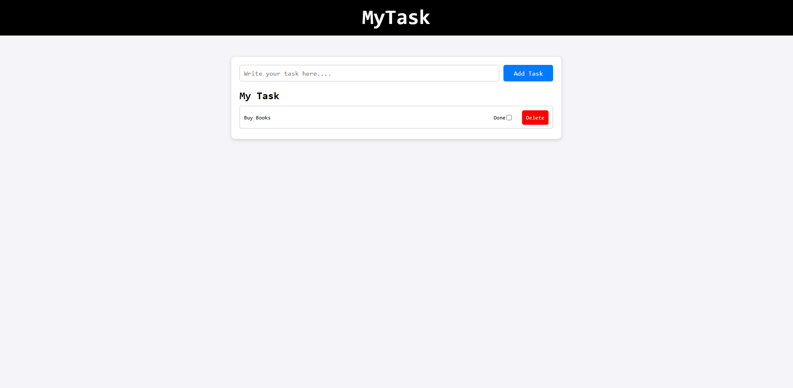

Here is a **professional, clean, and detailed README.md** for your **To-Do List Project**.
You can directly copy-paste it into your GitHub repo.

---

# 📌 To-Do List Web App

A simple and clean **To-Do List** web application built using **HTML, CSS, and JavaScript**.
This project allows users to add tasks, mark them as completed, and delete them easily.
Lightweight, beginner-friendly, and perfect for practicing DOM manipulation.

---

## 🚀 Features

### ✅ Add Tasks

Users can write a task and add it with a single click.

### 📝 Task Display

Each new task appears in the list with a **checkbox** and **delete button**.

### ✔️ Mark Task as Done

Checking the task applies a **line-through effect** and changes text color to gray.

### 🗑️ Delete Tasks

Each task has an individual delete button.

### ⏫ Latest Task on Top

Newly added tasks automatically appear at the **top** of the list.

### 🎨 Clean & Modern UI

Styled with pure CSS for a minimal and pleasant user experience.

---

## 🧩 Tech Stack

* **HTML5** – Structure
* **CSS3** – Styling
* **JavaScript (Vanilla JS)** – Functionality & DOM Manipulation

---

## 📂 Project Structure

```
/
│── index.html      # Main HTML structure
│── styles.css      # All styling
│── index.js        # JavaScript logic (Task add/delete/check)
└── README.md       # Project documentation
```

---

## 📸 Screenshots



---

## 🛠️ How It Works (JavaScript Logic)

1. User types a task → clicks “Add Task”.
2. JS clones a hidden template task card.
3. Text is inserted automatically.
4. Checkbox toggles strike-through effect.
5. Delete button removes the card.
6. Task is added at the top of the list.
7. Input clears after adding.

---

## 🧪 Code Highlights

### ✔️ Clone Template for New Tasks

```js
let taskTemplate = document.getElementById("task-list-0");
let task = taskTemplate.cloneNode(true);
task.style.display = "block";
```

### ✔️ Checkbox Strike-through

```js
checkbox.addEventListener("change", () => {
    if (checkbox.checked) {
        task.querySelector("p").style.textDecoration = "line-through";
        task.querySelector("p").style.color = "gray";
    } else {
        task.querySelector("p").style.textDecoration = "none";
        task.querySelector("p").style.color = "black";
    }
});
```

### ✔️ Delete Task

```js
deleteBtn.addEventListener("click", () => {
    task.remove();
});
```

---


## 📥 How to Run

1. Download or clone this repository:

```
git clone https://github.com/yourusername/todolist.git
```

2. Open `index.html` in any browser.

That’s it! No dependencies needed.

✅ A README with screenshots layout
Just tell me!
